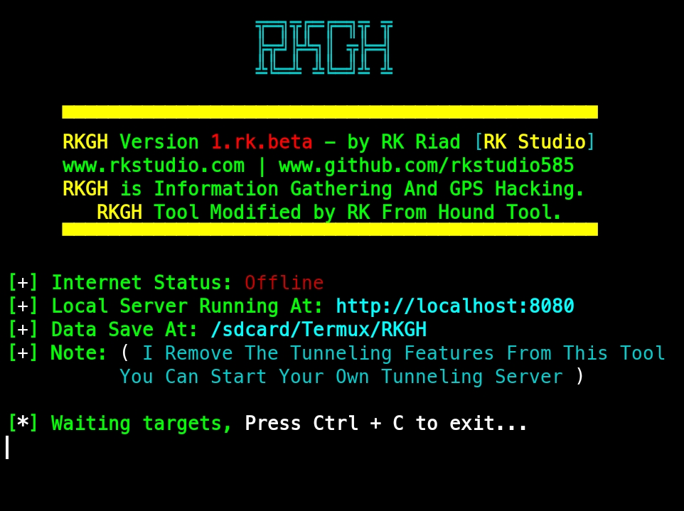
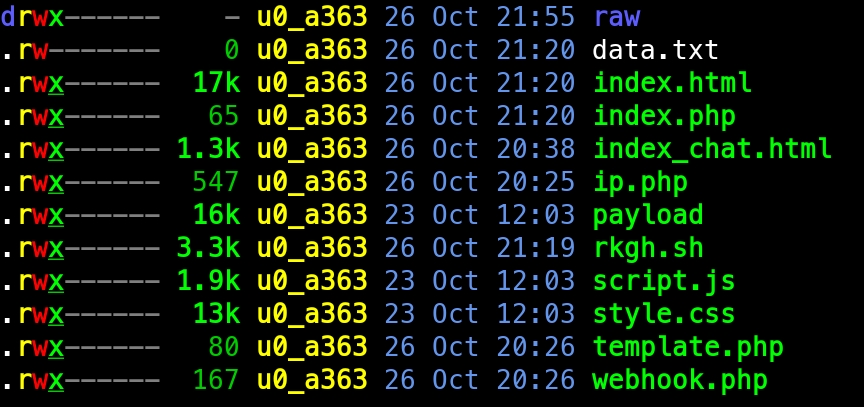
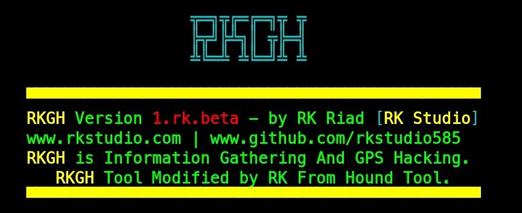
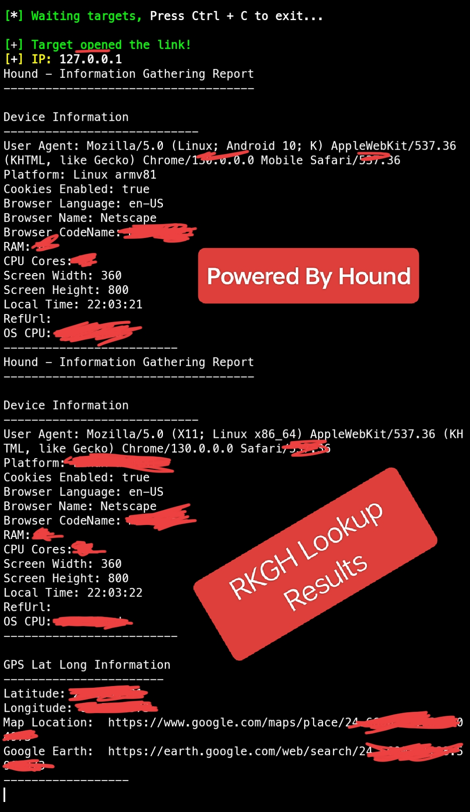

# RKGH 🚨

RKGH is a simple and light tool for information gathering and capture exact GPS coordinates.


---
# What is RKGH?
- RKGH is a tool that can remotely capture the exact GPS coordinates of a target device using a PHP server, and can also grab basic information about the system and ISP. This tool can be very helpful in information gathering. you can get following information of the target device.
  - Longitude.
  - Latitude.
  - Device Model.
  - Operating System.
  - Number of CPU Cores.
  - Screen Resolution.
  - User agent.
  - Public IP Address.
  - Browser Name.
  - ISP Information.

---
## Features:
  - The tool offers a wide range of features and functionality, including:
    - Capture Exact GPS Location.
    - Automated Data Collection.
    - Easy To Use.
    - User-friendly Interface.

---
## Note:
  - I Remove The Tunneling Features From This Tool You Can Start Your Own Tunneling Server.
  - This Tool Only Supposed On Termux So Enjoy.
  - You Can Delete `raw` Folder And `README.md LICENSE` File If You Need.
    - Command:
      ```bash
      rm -rf raw .git README.md LICENSE
      ```

## This Tool Tested On:
  - Termux 

---
## Installing and requirements.
This tool require PHP for webserver.
- If You Not Instead To Install Requirements Package 📦 Like That This Tool Auto Download The All Requirements Package 📦.
  - Command:
    ```bash
    apt install php git -y
    ```

---
## Installing (Termux):
Download This Tool On Your Termux App And Run.
- Command:
  ```bash
  git clone https://github.com/rkstudio585/RKGH.git
  cd RKGH
  bash rkgh.sh
  ```

---
## Tool Special Note:
  - RKGH is created to help in penetration testing and it's not responsible for any misuse or illegal purposes.
  - Hound Tool Modified by RK And Create A new Tool Called RKGH.
    - Credit - Chatbot template: Masud Rana.
    - Tool Create By Techchipnet.
    - Tool Modified By RK.

## Original Tool Link:
  - Hound Tool By Techchipnet.
    - [Hound Tool GitHub](https://github.com/techchipnet/hound)
    - [Techchipnet GitHub](https://github.com/techchipnet)

---
## Screenshots:

- Example Number 1:
  - 
---
- Example Number 2:
  - 
---
- Example Number 3:
  - 
---
- Example Number 4:
  - 
---
- Example Number 5:
  - 

---

# ** Enjoy! 😍 **

---
